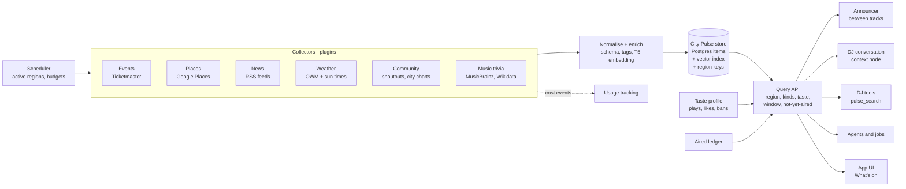

# PLAiR City Pulse

Design brief · Draft 0.2 · 28 Sep 2026 · For discussion

A shared, always-fresh picture of what is happening in each listener's city: gigs, venues, weather, news and, above all, the local PLAiR community. It is gathered once per city, stored in one searchable place, and handed to the DJs, the announcer and any agent that needs it, targeted to each listener's taste.

Draft 0.2 adds the **knowledge commons** (section 15): nothing a listener looks up is thrown away, what people ask for is itself a signal about the city, and the hosts get read tools so they can connect the dots from what is already on hand. Section 3 now records a code audit of where we are (28 Sep), and section 16 covers the realtime DJs' tool use.

Published version: https://claude.ai/artifact/1BNkXZQA9snyL9iwTaeciT

---

## 1. Why this exists

PLAiR is a social radio station as much as a music app. Spotify and the rest are disconnected from where you live; PLAiR is meant to feel like your city's station, with hosts who know what's on this weekend, what the neighbourhood is saying in its shoutouts, and what the scene is into right now.

Today the DJs can reach some of that, but only on demand and one API call at a time. Every consumer fetches for itself, nothing is shared between listeners in the same city, and the between-track announcer rarely has anything to say beyond the track names.

| Fact | Value |
|---|---|
| Median announcer window between tracks (last 300 breaks) | 5.4 s |
| Windows 10 s or shorter | 90% |
| Current AI cost per typical listener per month (rough) | $0.40–0.60 |
| Target fetches per city per refresh | 1, however many listeners |

City Pulse separates **gathering** from **speaking**. Collectors keep a regional store fresh in the background, and every part of PLAiR reads from that store instead of calling outside services.

The longer-term aim is a station that is genuinely alive: a cached, vectorised, self-organising body of local knowledge that grows with every listener request and every background sweep, stays current on its own, and lets the hosts pick from it freely: between tracks, in features, or through their own tool use. It saves money and bandwidth because most answers are already on hand, and it gives PLAiR a fingerprint of each city: what people there are listening to, asking about and talking about.

## 2. Principles

- **Gather once per city, target per listener.** A fetch serves everyone in the region. Personalisation happens at read time, locally, without an LLM call per listener.
- **Consumers read, collectors fetch.** The announcer, DJ, tools and agents never call Ticketmaster or Google directly. They query the store; the store decides whether anything needs refreshing.
- **Everything is an item.** A gig, a café, a headline, a shoutout, a weather change and a trivia fact share one schema, so one query can mix them.
- **Local embeddings, cheap enrichment.** Semantic search uses the T5 model already on the server. Any LLM enrichment runs in batches on DeepSeek during off-peak hours, under a daily budget.
- **Plugins, not a monolith.** Each source is a small collector with one interface. Adding a source means adding one file and a settings block.
- **Every lookup is a contribution.** When a listener's request forces a live fetch, the result is written back to the shared store for everyone in that area (write-through). Nothing fetched is used once and dropped.
- **Store first, fetch last.** Every read tries what is on hand, then fetches live only on a miss, inside a budget, and saves what it got (read-through).
- **Demand is data.** What listeners ask for is recorded anonymously per city. It steers what the collectors prefetch and gives the hosts something to talk about ("a lot of you have been asking about late-night food").
- **The hosts connect the dots.** Given compact, relevant facts (or read tools that return them), the hosts can link a gig to a listener's taste, the weather to a shoutout, a headline to a neighbourhood. The old brace-command system stays; this is an extra layer on top.
- **The sound stays sacred.** City Pulse only changes what the hosts know. The performance planner, overlaps, meta, breaths, impulses and the 0.8 clip similarity stay exactly as they are.

## 3. What exists today

| Piece | Where | Status | Notes |
|---|---|---|---|
| Weather | `external_web_service.py`, hourly updater | working | OpenWeatherMap, cached 30 min per ~1 km, persisted in `area_cache` so restarts don't refetch. Users and located guests (hourly change cues for guests are kept in memory only). |
| News | `external_news_service.py` + `news_store.py` | working | Google News only (country editions, topic sections, city geo feeds, search). Persistent semantic store, shared per country; see section 9. |
| Events | `external_events_service.py` | working | Ticketmaster Discovery v2. Keyword bug fixed 27 Sep (genre was dropped). |
| Places | `external_location_service.py` + `place_memory.py` | working | PLAiR Google project key (Places New). Collector keeps 50 place IDs per city; on-demand searches write through to `place_cache` / `place_searches`. |
| Artist bios, lyrics | MusicBrainz → Wikidata → Wikipedia; catalog | working | Bios persisted 30 days in `artist_biographies`, misses 24 h, shared by everyone. |
| Shoutouts search | `user_content_vector_*` | working | T5 embeddings + Annoy index; the model City Pulse follows. |
| Listener persona | `persona_service.py` | working | Updated every 5 interactions. Not yet seen by the announcer. |
| Content bank | `services_radio/dj_content_bank.py` | on | "Already aired" memory and next-artist trivia prefetch. |
| City events pool | `regional_knowledge.py` | working | One Ticketmaster sweep per city every 8 h, 28 days ahead, tagged by Ticketmaster genres, matched to taste. On-demand gig searches write through to the pool. |
| Cost tracking | `services/usage_tracking.py` | working | Every paid call attributed to a user, guest or "system". Collectors report here. |
| Announcer | `announcer_service.py` | working | Picks one of six prompt presets by window length (≤5 s … >25 s). |

### Audit: where we are (28 Sep 2026)

**What's in the database now:** 3 active regions (Auckland, Los Angeles, New York) with 956 regional items (754 events, 150 place IDs, 52 Auckland local headlines). There are also 256 stored news stories from 22 pulls, 35 aired-news rows, 83 artist bios, 8 area-signal cells, and 5 cached places from 1 stored place search.

**Scheduler:** `background_tasks_service.regional_knowledge_refresher` starts 3 min after boot and runs every 30 min. It covers the active regions: users with a play in the last 14 days, located guests (24 h), and guest session timezones. Collectors: events every 8 h, places every 14 days, news hourly.

**Write-through, by domain:**

| Domain | Background collector | A listener's request is saved for everyone | Where it lands |
|---|---|---|---|
| Events | yes | yes (`context_service.get_regional_events_data` → `regional.ingest`) | `regional_items` |
| News | yes (city geo feed only) | yes, but on-demand pulls carry no region | `news_items` / `news_pulls`; only the collector's city headlines reach `regional_items` |
| Places | yes (bare IDs) | yes | `place_cache` / `place_searches`; not `regional_items` (hydrated names are never written back) |
| Weather | hourly for users | yes, per ~1 km cell | `area_cache` (`weather_*`), `weather_data` per user |
| Area signals | no (lazy) | yes, per grid cell | `area_cache` |
| Artist bios | no | yes | `artist_biographies` |
| Shoutouts | n/a | n/a | user-content vector DB; not in the pulse |
| Lyrics | n/a | interpretation cached | catalog + `llm_result_cache` |

**Readers:** the announcer (through `bank_talking_points`: events and places, taste-scored, with a 2 h per-session "already offered" memory), Radio Mode segments (city, local, news with an aired ledger), and the DJ conversation (`local_happenings`, but only when the listener's words look like a gig question).

**Gaps against this brief:**

1. **Five stores, no single query.** Knowledge is split across `regional_items`, `news_items`, `place_cache`, `area_cache`, `artist_biographies` and the shoutout index. Each consumer knows which store to read; nothing can ask "what do we know about X near here" across all of them.
2. **No semantic search over regional items.** `regional_items` has no embedding column. A text query is a substring or tag match; only genre/tag labels have cached T5 vectors. News items do store embeddings.
3. **Demand is not recorded as a signal.** `news_pulls` and `place_searches` keep the queries they needed, but nothing aggregates what a city asks for, and nothing feeds it back into prefetch or on-air talk.
4. **No community kind.** Shoutouts are searched directly, station stats are global (not per city), and there are no city charts or local artists.
5. **Listener memory is thin.** It's the persona/profile/interests text on the `User` row, rewritten by Gemini every 5 engagements. There are no structured facts, no location history and no "What the DJs know about me" panel.
6. **The live DJ barely sees the pulse.** Interactive turns get `local_happenings` (regex-gated), current weather and the persona. Talking points, news store, places, area signals and listener notes are wired only into the announcer and Radio Mode.
7. **Tool use is half built.** See section 16.

## 4. Architecture

Four layers. Collectors fill the store on a schedule, the store indexes items by region, kind and meaning, a query API ranks them for a given listener and moment, and consumers turn the results into speech or UI.



### How a single break works

1. The announcer sees a 9-second window before the next track.
2. It asks the query API for up to two items for this listener's region that fit about 9 seconds and haven't aired for them.
3. The API filters the region's live items, scores them against the listener's taste profile with local embeddings, and returns, say, a jazz gig on Friday and a rain cue.
4. Those items go into the existing announcement prompt as quoted data, and the hosts perform them in their normal style.
5. The aired ledger records both items so they aren't repeated.

No outside API was called and no extra LLM request was made. The only added cost is a few dozen prompt tokens.

## 5. Contracts

Three small interfaces keep the system modular. Anything that honours them can plug in.

### The item

```text
PulseItem
  id            # stable: source + source_id
  source        # "ticketmaster", "shoutouts", "owm", "rss:nzherald" ...
  kind          # event | place | news | weather | community | trivia | stat
  region        # "nz/auckland" (see Regions)
  title         # short, speakable
  text          # <= 200 chars of facts, no markup
  tags          # genres, moods, categories
  starts_at     # optional (events)
  expires_at    # required: nothing lives forever
  url           # optional, for the app UI
  attribution   # licence / credit line
  personal      # false for shared items; true for listener memory
  embedding     # T5 vector of title + text + tags
  cost_usd      # what it cost to gather
```

### The collector

```python
class Collector:
    name: str               # "events.ticketmaster"
    kinds: set[str]         # {"event"}
    refresh: timedelta      # e.g. 6 h
    scope: str              # "region" | "global" | "artist"
    daily_budget_usd: float

    async def collect(self, region: Region) -> list[PulseItem]: ...
```

### The query

```python
pulse.query(
    region="nz/auckland",
    kinds={"event", "community", "weather"},
    listener=listener_id_or_guest,     # taste profile + aired ledger
    text=None,                          # optional: "jazz this weekend"
    window_s=9,                         # how long the hosts have
    limit=2,
) -> list[PulseItem]
```

### Location: two levels

PLAiR knows where the listener actually is (K Road vs Queen Street), so "local" means street level, not just city.

- **City level** (`regional_items`, key such as `tz:Pacific/Auckland` or `loc:nz:auckland`): things that are citywide by nature, such as gigs and events, news, weather and community charts. One fetch per city is shared by everyone there.
- **Point level** (`place_cache` + `place_searches`, built 27 Sep): every place carries its own coordinates. A search such as "good cafes nearby" is stored with where it was asked and what was meant. The next listener nearby (within `PLACE_MEMORY_REUSE_DISTANCE_M`, 400 m) asking something similar ("any coffee spots around here?") gets the stored results sorted by distance from where they are, without calling Google. If there is no matching search, the place memory itself is queried by distance and meaning (at least `PLACE_MEMORY_MIN_HITS` places within the radius). Everything is kept `PLACE_MEMORY_TTL_DAYS` (30). Meaning is matched with local word normalisation plus the T5 embeddings, so it costs nothing.

The listener's own coordinates are used live for the query and never stored in either level (stored searches keep only a ~100 m grid point). Businesses and venues keep their public coordinates.

**Where the listener is** comes from one resolver, `services_radio/listener_location.py` (`context_service.listener_location(user, session_id)`): lat/lon, the Google street-level description, city, region, country code and timezone. Logged-in listeners use their profile; guests share their device location over the WebSocket (`listener_location`, 4 decimals) after their first play or DJ interaction, never re-asked once declined. Guest positions live only in memory per guest session (6 h TTL, bounded, rate-limited, implausible jumps held until confirmed) and are never written to the database. Every consumer (news country and city feed, weather, weather/sky cues, events and the regional pool, places and place memory, area signals, local time, DJ context, Radio Mode) reads the resolver, falling back from location to the timezone city to `NEWS_DEFAULT_COUNTRY`.

## 6. Community layer

This is what makes PLAiR different, so it's a first-class part of City Pulse, not an add-on. The hosts should sound like they know the local PLAiR crowd.

- **Shoutouts as items.** Public shoutouts become `community` items tagged with their city and topics, using the existing shoutout vector search. The DJs can say "a few of you in Auckland have been shouting out the weather this week".
- **City charts.** What the region is playing and liking this week, computed in SQL from play events: "Auckland is on a shoegaze run".
- **Local artists.** Human uploads from listeners in the same city surface as "one of our own" moments, with the uploader's consent.
- **Conversation threads.** Shoutout replies and trending topics give the hosts callbacks: "that shoutout from Ponsonby got a lot of replies".
- **Events meet community.** Later: "three listeners liked tracks by this band, and they're playing Friday".

Only public shoutouts are used, never coordinates, and a listener can opt out of being featured.

## 7. Collectors

Refresh intervals are starting points; the scheduler only refreshes regions with listeners active in the last few days.

| Collector | Source | Refresh | Cost | Status | Terms |
|---|---|---|---|---|---|
| Events | Ticketmaster Discovery | 6–12 h | free tier | building | Link back to Ticketmaster for tickets. |
| Places | Google Places API (New) | weekly | ~$0.032 / search | needs key | Place IDs can be kept; most other fields have caching limits, so details are refreshed within Google's window. |
| News | Google News RSS only: country edition, NATION/WORLD sections, the city's geo feed | hourly per active region, no LLM | ~$0.0015 / ranking, once per pull, on first use | built | Headlines only, with attribution. International by construction; no outlet-specific feeds. |
| Weather | OpenWeatherMap + local sun maths | hourly | free tier | persisted | Sunrise, sunset and moon computed locally. |
| Community | PLAiR shoutouts, play events | 15 min | $0 | planned | Public shoutouts only; opt-out respected. |
| Music trivia | MusicBrainz, Wikidata, Wikipedia | daily | $0 | partly on | MusicBrainz CC0; Wikipedia CC BY-SA, paraphrase on air. |
| Holidays | Nager.Date | monthly | $0 | planned | Free, no key. |
| Weather alerts | National services (e.g. MetService RSS, api.weather.gov) | 15 min | $0 | planned | Check each country's terms. |
| Where the listener is | Google Geocoding (reverse) | 30 days per ~120 m cell | $0.005 / call | built, needs key restriction | Street/neighbourhood text only; shown as "via Google Maps". |
| Air quality | Google Air Quality (current conditions) | hourly per ~5 km cell | $0.005 / call | built, needs key restriction | Cue only when poor (UAQI < 40) or a big change; "Google air quality data". |
| Pollen | Google Pollen (2-day forecast) | daily per ~8 km cell | $0.01 / call | built, needs key restriction | Cue only at index 4+ (high); "Google pollen data". Seasons come from the data. |

The last three are **area signals** (`services_radio/area_signals.py` + one small module each: `area_geocode.py`, `area_air_quality.py`, `area_pollen.py`). They work at point level, not city level: each answer is stored in `area_cache` under a coarse grid cell (the cell id, never the listener's coordinates; Google is sent the cell centre), shared by every listener in that cell and fetched only when an active listener's break or conversation needs it. Each plugin has `name`, `refresh_s`, `available()`, `fetch(cell)` and `talking_points(...)`, an `AREA_*_ENABLED` switch and a daily call cap (defaults stay inside Google's monthly free allowance). A 401/403 pauses that API for 12 h and the DJs simply get no data. Reverse geocoding also feeds the `user_basic` context node ("Listener is around: Karangahape Road, Auckland Central, Auckland"), a one-off talking point when the listener's neighbourhood changes, and neighbourhood tags on place memory.

Last.fm and setlist.fm need permission for commercial use, Songkick is closed to new applicants, and Open-Meteo needs its paid plan for commercial use.

## 8. How the DJs use it

| Window | What the hosts get | Example |
|---|---|---|
| ≤ 5 s | One line, 15 words or fewer | "Rain's rolling in over the harbour, stay dry out there." |
| 6–15 s | One or two items | A gig matched to your taste, plus a city chart fact. |
| 15–40 s | Two or three items | A local headline, an event and a shoutout highlight. |
| 30 s – 1 min | A feature | Radio Mode talk breaks (Phase 4, built - see section 14): the song finishes, the hosts do a proper segment over a music bed, then the next track comes in. |

- **Announcer:** calls the query API with the window length and weaves the items into its existing prompt.
- **DJ conversation:** a context node supplies a short, relevant slice of the pulse. "Any gigs this weekend?" is answered from the store first; the live search stays as a fallback, and what it finds is saved for everyone in that city.
- **DJ tools:** a `pulse_search` tool for tool mode.
- **Agents and jobs:** read the same API (for example, a nightly job writing a shared "top of the hour" script per city).
- **App:** later, a "What's on in Auckland" panel built from the same items.

## 9. Storage and search

Postgres is the source of truth: one `pulse_items` table, plus an aired ledger and taste profiles. Semantic search reuses the local T5 embeddings, so it costs nothing per query.

| Option | For | Against |
|---|---|---|
| **Annoy index per kind**, like shoutouts (recommended to start) | Proven in PLAiR, no new installs, fast, rebuilds when stale. | Region filtering happens after the vector search; fine at city scale. |
| **pgvector** | Vector search, region filter and expiry in one SQL query. | Not installed on this PostgreSQL 18 (Windows); needs the extension built or installed. |
| **cube + earthdistance** (installed) | Radius queries for venues and places ("near the central city"). | Only for businesses; listeners never get coordinates stored. |

### News store (built 28 Sep 2026)

`services_radio/news_store.py` (tables `news_items`, `news_pulls`, `news_aired`) behind the unchanged `NewsService.get_top_news(...)` API. Settings: the `NEWS_*` block in `.env.example`.

- **Items**: one row per story (key = normalised title + source, so the same article in several pulls or countries is stored once), with URL, publish time, topic tags and a T5 embedding of the title (computed in the background on the GPU executor). Kept 48 h after last seen.
- **Pulls**: every Google News request is stored with its kind (`top`, `topic`, `geo`, `search`), country, region, normalised query, query embedding, item ids and the LLM ranking. The ranking call also returns 2–5 topic tags per picked headline ("all blacks", "rugby", "sport"), which is what makes later asks match by meaning.
- **Reuse**: an ask first looks for a pull of the same kind, country and normalised query inside its freshness window (top stories 45 min, city geo 60 min, topics and searches 3 h). Free-text asks ("what's going on with the All Blacks") then look at every fresh pull for that country: a pull is reused when its query is similar (`NEWS_REUSE_SIMILARITY`, 0.85, words or T5) and at least `NEWS_REUSE_MIN_ITEMS` (3) of its stories cover the ask through their titles or tags; otherwise any 3+ stored stories that cover it are served directly. Only then is Google fetched, and the result is stored for everyone in that country.
- **Why coverage, not a raw cosine**: mean-pooled flan-T5 embeddings of short topics are not reliable on their own ("rugby" vs "weather" scores 0.80, "rugby" vs "rugby news" 0.49), so reuse always has to be backed by stories that actually match. T5 is still used for query similarity and to spot the same story from another outlet (same-story headlines ≥ 0.89, different stories ≤ 0.71; `NEWS_SAME_STORY_SIMILARITY` 0.85).
- **Ranking**: stored on the pull, so a restart or a second listener never re-ranks. A refetch whose top 10 items were all in the previous pull reuses the previous ranking without an LLM call.
- **Prefetch**: the `google_news` collector refreshes each active region hourly (country top stories, `NEWS_PREFETCH_TOPICS`, the city's geo feed), one fetch per country or city however many listeners, with no LLM call; ranking happens once, when a bulletin or the DJ first uses the pull. The city's local headlines also land in `regional_items` as `news` items.
- **Aired**: `news_aired` records per listener (session id) what the hourly bulletin and DJ news segments aired, for 12 h. Aired stories and the same story from another outlet are pushed to the end (the bulletin skips them). Survives restarts.

## 10. Cost model

Because gathering is per city, cost grows with the number of cities, not listeners. Reading is local and free. These are planning estimates, to be checked against the AI usage view.

| Item | Per city / month | Per listener / month |
|---|---|---|
| Events sweep (Ticketmaster, 4 per day) | $0 | $0 |
| Places (e.g. 10 categories, weekly refresh) | ~$1.40 | shared |
| News ranking (Gemini flash-lite while DeepSeek returns 402; ~$0.0015 per ranking with tags; bulletin topics ranked at most hourly per country, reused when unchanged) | ~$0.50–1.50 per country | shared |
| Community and charts (SQL) | $0 | $0 |
| Area signals, per active cell, list price past the free tier (10k geocoding, 10k air quality, 5k pollen calls a month free): air quality ≤ $3.60 (a cell listened to 24/7, hourly), pollen ≤ $0.30, geocoding $0.005 per 120 m cell per 30 days | ~$0 inside the default daily caps | shared; ~$0.50 for a lone 3 h/day listener |
| Extra prompt tokens in announcements and chat | – | ~$0.02–0.05 |
| Quick wins already approved (aired memory, trivia, notes, cues, stats) | – | ~$0.10 |

For comparison, the plan nets about $4.55 per subscriber after Stripe fees, and a typical listener costs roughly $0.40–0.60 in AI today. Every collector reports its spend to usage tracking, and each has a daily budget cap.

## 11. Privacy and terms

- Listener coordinates are never stored in City Pulse. Region is city level at most.
- Personal items (listener memory) are kept apart from shared items. They're never shown to other listeners, kept 180 days, and viewable and deletable from a "What the DJs know about me" panel.
- Sensitive topics are never stored as memory: health, religion, sexuality, politics, money, children.
- Only public shoutouts feed the community layer, with an opt-out.
- Each source's terms are recorded in its collector: attribution lines, caching limits (Google Places), paraphrasing (Wikipedia) and link-backs (Ticketmaster).

## 12. Roadmap

| Phase | When | Scope |
|---|---|---|
| 0 | Now · in progress | Aired memory and next-artist trivia (on). Listener notes, weather and sun cues, station stats, guest timezones. City events pool, shaped as the first collector. |
| 1 | Foundation · ~1 week | `pulse_items` store, collector interface, scheduler and query API. Move the events pool, news and weather onto it. Announcer and DJ context node read from the query API. Done 28 Sep: persistent semantic news store with hourly regional prefetch and a per-listener aired ledger; weather and biographies persisted. Next: the announcer reading local headlines from the pool. |
| 2 | Community · ~1–2 weeks | Shoutouts, city charts and local artists as community items. Places collector once the Google key is enabled. Holidays, weather alerts, artist anniversaries. |
| 3 | Memory · ~1 week | Listener memory from conversations, extracted nightly off-peak. "What the DJs know about me" panel. |
| 4 | Talk breaks · built 28 Sep 2026 | Opt-in Radio Mode: news on the hour, city update at :30, features every 15/20/30 min, 30–60 s over a music bed. News/city scripts shared per city and half hour, reused by the TTS clip cache. Details in section 14. |
| 5 | App surface | "What's on in your city" in the app, linked to shoutouts and gigs. |
| 6 | Commons foundation · ~1 week | Section 15, steps A–D: the `pulse` facade over the existing stores, item embeddings and semantic search, the demand ledger, and the missing write-through (regioned news, named places). No new outside APIs. |
| 7 | Knowledge tools · ~1 week | Section 16: the `city_pulse` context node for every interactive turn (tool mode on or off), then the read tools (`pulse_search`, `pulse_detail`, `listener_context`, `city_trends`), tests, and tool mode switched on for a trial. |
| 8 | Personal features · ~1–2 weeks | Section 15, "Made for you": the `personal` Radio Mode feature built by a bounded, read-only agent from taste, habits, neighbourhoods and the pulse; consented neighbourhood history. |

## 13. Open questions

1. **Launch cities.** Start with Auckland only, or every city with an active listener from day one?
2. **Guests.** How much of the pulse do guests get? Shared items only (cheap) is the current assumption.
3. **Featuring listeners.** Should shoutout and local-artist mentions be opt-in or opt-out?
4. **Places.** Enable Places API (New) now, and which categories matter: cafés, bars, record stores, venues?
5. **Vector search.** Stay on Annoy (like shoutouts) or install pgvector for combined SQL queries?
6. **Talk breaks.** Answered in Phase 4: opt-in, never mid-song; the song finishes, the hosts talk over a quiet bed, and the next track is posted under their last seconds. Frequency is the listener's choice (15/20/30 min).
7. **"In the style of".** Catalog tracks carry the name of the real artist each AI track was modelled on. Should hosts frame trivia as "in the style of"?
8. **App panel.** Is a visible "What's on" page part of the product, or should the pulse stay behind the DJs?
9. **Demand on air.** How many distinct listeners must ask about something before the hosts may mention it as a city trend? The proposal is at least 3, never naming anyone.
10. **Neighbourhood history.** Should "places you spend time" (neighbourhood names and counts, never coordinates) be opt-in for everyone? The proposal is opt-in, users only.
11. **Tool mode.** When the knowledge tools exist, should tool mode become the default for signed-in listeners while guests stay on two-pass, which is cheaper?
12. **Places terms.** Hydrated place names written back into the pool extend what we keep from Google. The owner already chose 30-day caching; confirm it also covers the pool.


## 14. Radio Mode: talk breaks (Phase 4, built 28 Sep 2026)

Radio Mode lets the station take over now and then, like real radio: a short news bulletin at the top of the hour, a weather and city update at half past, and a feature every 15, 20 or 30 minutes. It is **off by default**; listeners switch it on in the User panel (guests too). A break never cuts a song off: it waits for the end of the current track.

### What the listener hears

1. The current song plays to its natural end. A few seconds before its last note (where it would normally crossfade), the hosts come in over the tail and the song ducks under them.
2. The song finishes. The hosts carry on for 30–60 seconds over a quiet instrumental bed (one of the Suno beds in `MUSIC_BEDS_DIR`, picked by segment type with rotation, looped sample-accurately on the Opus file and ducked well under the voices). The performance is the normal DJ sound: two hosts overlapping, paralanguage, studio sounds, breaths, impulses, the same TTS pipeline and clip cache.
3. In the last 2.5 seconds of the segment the next track fades in under them, and the music comes back up as they stop.

The Player and the Radio panel header show a small **ON AIR · News** badge while it runs, on every device in the session. Only the active device plays anything. The transcript appears in the conversation feed under the announcer filter.

### Schedule rules (defaults, all in `.env`)

| Rule | Default |
|---|---|
| News | at :00 of the listener's local hour (`RADIO_NEWS_MINUTE`) |
| Weather & city update | at :30 (`RADIO_CITY_MINUTE`) |
| Features (local & gigs, community, trivia) | rotate, one every 15/20/30 min since the last break (listener picks; default 20) |
| Earliest a clock segment may air | 90 s before its minute (`RADIO_CLOCK_EARLY_S`) |
| Latest | 15 min after, otherwise dropped for that hour (`RADIO_CLOCK_LATE_S`) |
| Minimum gap between breaks | 5 min (`RADIO_MIN_GAP_S`) |
| A feature is held back if a clock segment is due within | 10 min (`RADIO_FEATURE_YIELD_S`) |
| Preparation starts | 120 s before the boundary (`RADIO_PREPARE_LEAD_S`; Orpheus renders a little slower than real time) |
| No break is prepared while the listener talks to the DJs | until 60 s after their last turn (`RADIO_CONVERSATION_QUIET_S`) |
| Hard cap on air | 180 s (`RADIO_ON_AIR_MAX_S`) |

A break is due at the first track boundary after its time. If the segment is not fully rendered on the active device by that boundary, nothing waits: the normal crossfade happens and the break moves to the next boundary.

### Segment plugins

Each segment type is a small class in `server/services_radio/radio_segments.py` (`RadioSegment`: `kind`, `label`, `pref`, `clock_minutes`/`clock_hours` or feature rotation, `priority`, `target_s`, `guest_allowed`, a `build(ctx)` content builder that returns facts from the existing sources, and an `instruction` prompt preset), registered with `register()`.

| Kind | When | Length | Facts from | Guests |
|---|---|---|---|---|
| `news` | :00 | 40–60 s | `external_news_service` national and world headlines for the listener's country, minus headlines this listener already heard | yes (country from the device location, else the timezone city) |
| `city` | :30 | 35–50 s | OpenWeatherMap now and today, sunrise/sunset/moon, air quality and pollen cues, the neighbourhood (`area_geocode`), one gig tonight from the regional pool | yes (weather at the device location, else the city centre) |
| `local` | feature | 40–60 s | Ticketmaster pool matched to the listener's taste, one spot from the places pool | yes (city from the device location, else the timezone) |
| `community` | feature | 40–60 s | recent listener shoutouts (the hosts may play one clip with `$path$`), station and listener stats | yes |
| `trivia` | feature | 35–55 s | biography of the artist credited on the next track (MusicBrainz/Wikipedia via `WebService`), plus the track's genre and style | yes |

Adding **traffic** later is one class: `kind = "traffic"`, `pref = "traffic"` (plus a toggle in `RadioModeSettings.jsx` and the key in `radio_schedule.SEGMENT_PREF_KEYS`), `clock_minutes = (15, 45)`, `clock_hours = (7, 8, 16, 17)`, a `build()` that reads a traffic collector, and an instruction. The scheduler, prompt, TTS, playback, beds and UI pick it up unchanged.

### How it works inside

- **Scheduler** (`server/services_radio/radio_mode_service.py`, pure rules in `radio_schedule.py`): state only for sessions with Radio Mode on, ticking every 2 s, and only while a WebSocket is connected, the active device is online, music is playing and the DJ voice is not muted. It picks the slot, builds the facts, writes the script (role `LLM_INTERPRET`: DeepSeek with Gemini fallback, `radio_segment` preset in `dj_prompt_service.py`, nodes `instruction_radio_segment` and `data_radio_segment` in `context_nodes.py`, facts wrapped as untrusted data), picks a bed, and queues the script on the normal TTS queue with `tts_type="radio_segment"`.
- **Pre-rendering**: the TTS stream goes to the active device while the song is still playing. `DJStreamPlayer` stages `radio_segment` streams instead of playing them. When a stream ends complete (`tts_stream_end` now carries `complete` and `duration_s`), the client reports `talk_break_ready`; the server marks the break ready and publishes it in `playback_state.talk_break` (with `after_track_id` = the current track).
- **The hold** (`audioEngine.armHold` / `resumeFromHold`): the active device arms a hold on the current track; the engine skips its auto-crossfade for that track and calls back at the talk-up point. `TalkBreakController` (`client/src/lib/talkBreak.js`) releases the staged segment, starts the bed (`client/src/lib/musicBed.js`), reports `talk_break_start`, posts the next track 2.5 s before the end and reports `talk_break_end`. The ordinary `track_transition` is sent by that crossfade as usual, so the playback transport, versions and acks are untouched.
- **Aired ledger**: headlines, gigs, shoutouts and artists that went on air are remembered per listener for 6 h (`RADIO_AIRED_MEMORY_S`) and marked in the content bank so the between-track announcer doesn't repeat them. The announcer stays quiet at a break boundary and for 90 s after a break.
- **Sharing**: news scripts (and guests' city scripts) with identical facts are shared by everyone in the same city and half hour, so a city costs one LLM call per bulletin and the TTS clip cache (0.8 similarity) makes the repeats nearly free to render. Concurrent requests for the same script wait for the first.

### Interactions

| Listener does | Result |
|---|---|
| Skips, goes back, seeks or picks a track before the boundary | the hold is released; the break stays ready and airs at the next boundary |
| Skips during the break | the segment and bed stop at once, the skip proceeds, the break counts as aired |
| Talks to the DJs before the boundary | the render is cancelled by the usual interrupt; the break waits until the conversation is over, then re-renders from the same script (cheap: clip cache) |
| Talks to the DJs during the break | the interrupt stops the segment, the next track starts, the DJ reply plays over it |
| Pauses during the break (on any device) | the segment and bed pause; play resumes them |
| Moves playback to another device | before air: the break re-renders for the new device; on air: the break ends and the new device carries on with the music |
| Reloads the page during a break | the device tells the server the break was lost; it ends |
| Turns Radio Mode or that segment off, or mutes the DJ voice | pending breaks are dropped |

### Settings

- Listener: `enabled` (default off), `news`, `city`, `local`, `community`, `features`, `stings` ("Stings & time checks", default on), `feature_interval_min` (15/20/30). Logged-in users: `user_radio_settings` table through `preferences_service` (`GET/PUT /api/radio-mode`). Guests: `safeStorage` key `radioMode`, sent as `radio_mode_prefs` on every WebSocket connect (sent as off while the DJ voice is muted).
- Station: the `RADIO_*` block in `.env.example` (kill switch `RADIO_MODE_ENABLED`, per-type `RADIO_SEGMENTS_DISABLED`, `RADIO_MAX_SCRIPTS_PER_HOUR` cost breaker, beds `RADIO_BEDS_ENABLED` / `RADIO_BED_TARGET_LUFS`). Beds are served read-only by `GET /api/music-beds/{id}[?format=opus]` and never touch the catalog.

### Stings & time checks (built 28 Sep 2026)

Real stations fill the short gaps between songs with station IDs, sweepers, jingles and a time check. PLAiR now does the same without any LLM call.

**What the listener hears**

- **Station IDs**: "You're listening to Plair.", "Plair. Left of the dial.", "Late nights on Plair.", "Plair, in Auckland." (36 lines, some only at certain hours, six with the listener's city). No line repeats within the listener's last eight IDs.
- **Talking clock**: a robotic, bFM-style time check in the listener's local time: "Plair time. Eight. Twenty-nine. P.M." Sometimes it ends on a short musical button; on the hour it can start with the top-of-the-hour pips.
- **Musical stings**: short hits, risers, endings and a sonic-logo phrase, cut from two Suno idents.
- **Combinations**: an ID over a riser that lands on the hit, an ID over a sound-effects sweep, or an ID over the sonic logo.

All of it is voiced by a third voice, the **station computer** (Orpheus `zac`, distinct from the hosts `leo` and `tara`). It runs through a radio-band EQ with a little ring modulation, comb and bitcrush, then a short slap and a small room, then the normal voice chain. It streams through the same DJ audio path as the hosts (`tts_type` "sting"), so it gets the same processing, plays only on the active device and ducks the music the same way.

**When it plays** (defaults, all in `.env`)

| Rule | Default |
|---|---|
| Announcer window too short for a good line | under 6 s gets a sting instead of an LLM line (`STINGS_SHORT_WINDOW_S`) |
| Longer windows | every 4th break is a sting (`STINGS_ROTATION_N`); the rest keep the LLM announcer |
| Smallest window | 1.5 s (`STINGS_MIN_WINDOW_S`); each type has its own minimum (musical 1.5 s, ID 2.2 s, time check 2.8 s, sweeper 3 s, logo + ID 4 s) |
| Time checks | at most one per 15 min, on a round minute (:00, :05, ...), any minute after 30 min; only when the listener's timezone is known |
| Never back to back | the same type never plays twice in a row; at least 60 s between stings |
| Quiet | nothing while the listener is talking to the DJs (30 s), while DJ audio is queued, during a talk break or its quiet time, or without an active device |
| Talk breaks | half of the Radio Mode breaks open with a station ID or the sonic logo, inside the break's own stream |
| Mid-track (Radio Mode only) | at most once per 30 min, 35% chance, in a lyric-free quiet passage of 4 s or more between 20% and 80% of the song, 2.5 s max |
| Outside Radio Mode | between-track stings also play when Radio Mode is off (`STINGS_OUTSIDE_RADIO_MODE`); the listener's toggle still applies |

**How it works inside**

- `sting_service.py` sits in front of the announcer. At each analysed transition the announcer asks it first (`plan_between_tracks`); if it picks a sting, the announcer builds it 1.5 s before the window starts and posts it 0.3 s before, instead of the LLM line 5 s early.
- Sting types are a registry (`sting_types.py`: `station_id`, `sweeper`, `musical`, `logo_id`, `time_check`), each with a weight, a minimum window and a `build()`. The rules are pure functions in `sting_schedule.py`.
- **Exact clock**: every clock part (5 intros, hours 1-12, "O'clock", "Oh one" to "Oh nine", "Ten" to "Fifty-nine", 8 dayparts: 82 clips) has an exact-text key in its own cache (`station_voice.py`, FLAC files + `index.json` under `data/tts_dj_engine_data/station_audio/<voice>/`). A missing part means that time check is skipped and the part is queued at the front, never a near match. After rendering, hours and minutes are checked with the fast Whisper model and re-rendered if heard as a different number.
- **IDs** follow LifeSpan's pattern: play the best cached take (a near match is fine for these, but never a line naming another city) and queue the exact line for next time. City lines are rendered on first use, at most 12 per hour.
- **Pre-rendering**: after startup the whole clock and all generic IDs are rendered at low priority, one at a time, behind the same gate that yields to live DJ speech. About four minutes of GPU once, spread out; afterwards everything is cached.
- **Musical stings**: `STINGS_DIR/manifest.json` (id, file, kind, duration, hit time, loudness). They were cut from two Suno generations (2 x 12 credits) by onset and energy analysis, faded, and levelled to -16 LUFS short-term with a -3 dBTP ceiling. Nothing enters the catalog. Sound-effects clips (`audio_effect_audio`) with titles in `STINGS_SFX_TITLES` are used as sweeper beds.
- Usage: renders are recorded as `stings.station_voice.*` GPU time, plays as `stings.<type>` cache hits.

### Cost (estimate)

One segment script is about 4–5k prompt tokens and 0.6–1k output tokens: roughly $0.002–0.004 per break (DeepSeek flash off-peak up to Gemini flash-lite). With news, city and 20-minute features a listener hears about four breaks per listening hour, about $0.01–0.015 per hour, so **$0.60–1.00 a month** for someone listening 2–3 hours a day with Radio Mode on; less where several listeners share a city, because news and city scripts are shared. News ranking, weather and events are already shared per city. Rendering is local GPU time (about a minute of Orpheus per break when nothing is cached). Every call is attributed to the listener's session under `radio_mode.news`, `radio_mode.city` and so on in the AI usage view.

### Tests

- Backend mock harness (102 checks): schedule timing (:00, :30, every N min, early and late windows, yielding), deferral to the next boundary, conversation deferral and re-render, preference and mute gating, active device only, guest vs user, skip and transfer before and during air, render failures and timeouts, the on-air watchdog, shared scripts, the script budget, bed manifest safety and rotation, WebSocket routing, the announcer gate.
- Client unit harness (86 checks): engine hold and resume, staged DJ streams, the talk-break controller, the bed player.
- Headless Chrome (`--disable-gpu --mute-audio`) against the Vite dev server and a mock backend: a full guest break (ready, hold, on air, bed, ducking, post, end, the ON AIR badge on the active and a second, inactive device) and a skip during the break.
- Five real LLM scripts (news, city, local, community, trivia) checked for tone, facts and length.
- Stings harness (91 checks): the clock for all 1440 minutes (exact parts only, parsed back to the same time), exact-key cache, window thresholds, rotation, time-check spacing, Radio Mode and listener gating, no back-to-back repeats, talk-break exclusion, mid-track rules, the sting stream through the live encoder, the break lead-in and the announcer hook. A real render set on the P6000 (about 2 minutes of GPU) was checked with Whisper.

## 15. The knowledge commons (Draft 0.2)

City Pulse started as "gather once per city". The commons goes further: every source, every background sweep and every listener request feeds one living body of knowledge. It organises itself by place, kind and meaning, stays fresh on its own, and anything that speaks can draw on it. The aim is threefold: fewer outside calls, a real fingerprint of each city, and hosts that sound like they live there.

### Knowledge nodes (plugins over the existing stores)

The data already lives in good, purpose-built stores (section 3 audit). The commons does not migrate them into one table. Each store gets a thin **knowledge node** adapter, and one facade queries them all.

```python
class KnowledgeNode:
    name: str              # "events", "news", "places", "weather", "area", "bios", "shoutouts", "charts", "memory", "trends"
    kinds: set[str]        # item kinds it answers
    scope: str             # region | cell | point | artist | listener
    personal: bool         # listener-only items (memory)

    async def search(self, q: PulseQuery) -> list[PulseItem]   # on-hand only, never calls out
    async def fetch(self, q: PulseQuery) -> list[PulseItem]    # optional: live, budgeted, writes through
```

`pulse.query(PulseQuery)` fans out to the nodes that match the requested kinds. It merges the results, drops duplicates (same story, same venue), removes what this listener has already heard, and ranks by:

- relevance: tags, words and T5 meaning;
- taste: the existing `Taste`;
- freshness;
- proximity in time and distance;
- novelty;
- demand: what the city is asking about.

When `allow_fetch` is set and the store has too little, the best node's `fetch()` runs once, inside the caller's budget, and saves what it gets for everyone. Adding a domain (traffic, holidays, sports fixtures, transit alerts) means writing one node and, if it needs one, one collector.

`PulseItem` stays as in section 5, plus `node`, `freshness` and `demand` fields for ranking.

### Semantic search

- Add an `embedding` column to `regional_items`, filled in the background from `embed_text` on the GPU executor, the same way `news_items` already does it.
- City scale is small: at most 400 items per kind per region. A brute-force numpy cosine over a region's vectors, held with the existing read cache, takes well under a millisecond, so no Annoy index is needed yet. pgvector stays optional (question 5).
- Keep the scoring hybrid. Mean-pooled flan-T5 is unreliable on short topics (section 9), so meaning never wins on its own: a hit needs a tag or word overlap, or a strong cosine on the full item text.

### Demand ledger: the city's fingerprint

Every read that comes from a listener's own request (DJ turn, tool call, app search) records what was asked. System reads such as Radio Mode builds and prefetch are not recorded.

```text
pulse_demand          region_key, node, normalised query, query embedding, day,
                      asks, distinct_askers, served_from_store, served_live, last_asked_at
pulse_demand_askers   demand_id, day, asker_hash      # daily-salted hash, purged after 2 days
```

Similar queries collapse into one row, matched by words plus T5, the same way news reuse works. No user ids and no coordinates are stored.

It is used for:

- **The fingerprint:** a weekly top list per city. For example, Auckland this week: jazz gigs, late-night food, All Blacks, the rain.
- **Steering prefetch:** a query asked by 3 or more distinct listeners in a region is added to that node's next sweep: a Ticketmaster keyword, a news topic, or a places category. Demand makes the store grow where people are actually curious.
- **On air:** trending asks become `community` items ("a few of you have been asking where to eat late"). They only air once at least 3 distinct listeners have asked (question 9).
- **Savings:** the store vs live split per node shows how much the commons saves. `usage_tracking.record_api_call(cached=True)` already supports this.

City charts belong to the same layer: what a region played, liked and banned this week, computed in SQL. That needs a `region_key` on new `play_events` rows, set from the listener location resolver at play time.

### Freshness and upkeep

Items stay current three ways:

- **Scheduled collectors**, as today.
- **Demand-driven sweeps**, from the ledger above.
- **User-driven live fetches**, which refresh the shared entry for everyone.

A read of an item that is stale but not yet expired returns it at once and schedules a background refresh, the pattern area signals already use. Every item keeps a hard `expires_at`. Each node has a daily budget and reports its spend to usage tracking.

### Personal layer

Personal items are only ever read for their own listener (section 11 still applies).

**Listener facts.** Phase 3 memory becomes structured rather than one persona paragraph:

```text
listener_facts   user_id, kind, text, embedding, source, confidence, created_at, last_confirmed_at, expires_at
```

- Kinds: `likes`, `dislikes`, `plans` ("going to Laneway"), `life`, `places`.
- They are extracted nightly off-peak from conversations (`LLM_BACKGROUND`).
- Sensitive topics are never stored.
- Listeners can view and delete them in the "What the DJs know about me" panel.
- The persona text stays as a summary.

**Neighbourhood history.** This is opt-in and for users only (question 10).

```text
listener_areas   user_id, neighbourhood, city, region_key, hour_bucket, weekday_bucket, visits, last_seen_at
```

- The names come from `area_geocode` at listening time. It stores names and counts only, never coordinates.
- It lets PLAiR tell "home turf" and "the work area" apart from travelling ("you're in Wellington this week"). A traveller can still hear about their home city.
- Guests keep the current behaviour: memory only, 6 h.

### Made for you (personal features)

A new Radio Mode feature, `personal` ("For you"), is a segment class like the others (section 14). Its `build()` differs: it runs a small **read-only agent** instead of a fixed fact query.

- **Inputs:** taste, listener facts, usual neighbourhoods, local time and weather, and the pulse. The agent reads them through the section 16 read tools.
- **Limits:** `LLM_INTERPRET`, at most 3 rounds, no live fetches beyond the node budgets, and no action tools. The script is prepared 120 s ahead anyway, so the extra rounds cost no air time.
- **Output:** 3–5 connected facts in the usual `data_radio_segment` format. The script prompt, performance planner and sound are unchanged.
- **Example:** "Your jazz Friday: a trio at a K Road bar ten minutes from where you usually listen, the rain clears by eight, and two Auckland listeners shouted out the same band last week."
- **Cost:** about $0.003–0.006 per feature, capped per listener per day.

## 16. DJ tool use: the knowledge layer for the realtime hosts

### Where it is today (audit, 28 Sep)

- **Two-pass flow (live default).** The DJ reply is spoken first. The HAL11000 pass then extracts brace commands, which `dj_command_executor` runs. The DJ never sees what the commands did.
- **Tool mode** (`DJ_TOOL_USE_ENABLED`, **off** in `.env`) runs one Gemini conversation per turn with 15 tools (section 5 of `CLAUDE.md`).
  - It has run live once: 27 Sep, a guest end-to-end test. `search_and_play` and `get_news` executed, `rate_track` was correctly blocked for the guest, and the turn took about 6 s.
  - There are no automated tests.
- **The content tools can't look anything up.** `get_news`, `get_weather`, `get_events`, `find_places`, `get_artist_biography`, `explain_lyrics` and `play_shoutouts` return only `{"status": "scheduled"}`. The facts go to a separate interpretation prompt that airs after the reply. In tool mode the hosts can act but cannot look things up. Only `search_and_play` returns data (the matching titles).
- **What an interactive turn sees without tools:** `local_happenings` (only when the words match a gig regex), current weather, persona/profile, and recent airings. Talking points, the news store, places, area signals and listener notes reach only the announcer and Radio Mode.
- **Robustness gaps in tool mode:**
  - The tool turn calls Gemini directly (`llm_router.gemini_generate`), so it skips the `LLM_LIVE` provider chain and circuit breaker.
  - After any tool record or spoken preamble, a failure no longer falls back to two-pass.
  - An empty final text leaves the turn silent.
- **The announcer and Radio Mode use no tools.** Their facts go straight into the prompt.

### Built 28 Sep 2026 (phases 6-7, first pass)

- `services_radio/pulse.py`: the facade with nine knowledge nodes (events, places, news, weather, area, artists, community, charts, trends), hybrid ranking, one budgeted live fetch with write-through, the demand ledger (`pulse_demand`, `pulse_demand_askers`) and region charts (`play_events.region_key`, backfilled for users).
- `regional_items.embedding`: T5 vectors filled in the background after every sweep or ingest.
- Read tools `pulse_search`, `pulse_detail`, `listener_context`, `city_trends`; the `city_pulse` node replaces `local_happenings`.
- Tool mode is on and is the only DJ path. The Producer AI plans the tools (`needs_tools`, `tool_plan`), coverage decides whether the plan is needed, and the nodes `tool_guidance` and route-aware `guidelines_critical` carry the decision into the prompt. Tool-free turns use HAL11000 for actions by design. Design notes taken from LifeSpan: planner before the loop, tool discipline in the prompt, capped recovery on empty replies, fillers outside the model.
- Test (guest on K Road, 28 Sep): gigs, jazz, All Blacks, coffee, city trends and the current band were all answered with real specifics in 3.6-6.4 s. Live Ticketmaster and Places fetches ran only on misses and were saved for everyone.

### Built 28-29 Sep 2026 (second pass): nuggets, links and autonomy

- **Nugget facets.** Every item in `regional_items` carries subject (T5 vector), place, time and names. Ticketmaster events keep venue coordinates, address and performers. Shoutouts are community nuggets for their city (`CommunityCollector`, every 15 min), with suburb, grid point, category tags and age. Queries slice by subject, kind, time window, distance from the listener, age, and order (newest, soonest, nearest).
- **Links.** A shoutout or headline that names a venue or performer links to that gig (and back). Items on the same subject link by vector, and venues and places within 600 m link as "nearby". The DJ sees `linked` notes in results; `pulse_detail` lists the connections.
- **Announcer menu.** Between tracks, the announcer gets a menu of pulse items sized to the window and decides what to use, or nothing.
- **For You.** A rare Radio Mode feature, about every two hours per listener. It is a free-roaming read-only agent: told only to research a two-minute narrative for this listener, it discovers the listener's taste, recent conversation and what's on air through tools, explores the city's nuggets and picks its own angle. First test (owner account): "Your Eden Terrace Local Loop", 8 tool calls in 8 s, every beat grounded in a tool result.

### Built 29 Sep 2026 (third pass): one semantic pattern

The first passes built their own matching next to the existing vector architecture. That is replaced: everything searchable is now a source on the same `BaseVectorDatabaseService` pattern as tracks and shoutouts. Each source has named semantic categories with weights, per-query category weights from the query-intent prompt cache, and a search-then-re-rank step. Categories are declared as a list (`Category(name, weight, extractor, description)`), so a new category is one line.

- **Local knowledge**: events and local news, a view over `regional_items`.
- **Listener requests**: every ask plus what the station answered, clustered into city trends that steer the news and gig sweeps.
- **Shoutouts**: searched by the existing shoutout search service.
- **Encoder:** City Pulse sources use a sentence encoder (all-mpnet-base-v2). Mean-pooled flan-T5 scored "Comedy" against "Family" at 0.81. On the same data mpnet returns the four real comedy shows for "comedy", the three Tuning Fork gigs for "what's on at the Tuning Fork" and The Wiggles for "family show for the kids". Tracks and shoutouts stay on T5 for now; moving them is a per-source setting.

### What to add (on top; nothing removed)

The two-pass flow, the brace commands and the segment tools all stay. The knowledge layer adds two things.

**1. A `city_pulse` context node for every interactive turn, in both flows.**
- It calls `pulse.query(text=<listener's words>, listener=..., limit≈4, allow_fetch=False)` and returns compact facts, at most about 400 characters, wrapped as untrusted data.
- It replaces the regex gate on `local_happenings`.
- The ranking is local and costs a few dozen prompt tokens.
- This alone lets the hosts connect dots from what is already on hand, even with tool mode off.

**2. Read tools that return data to the model (tool mode).**

| Tool | Returns | Calls out? |
|---|---|---|
| `pulse_search(query, kinds?, when?, near_me?)` | up to 6 items: id, kind, title, ≤160-char text, when, distance, freshness, `aired_recently` | Store first. Live only on a miss, at most 2 fetches per turn, and saved for everyone. |
| `pulse_detail(item_id)` | the full item plus related items (same venue, artist or story) | hydrate only |
| `listener_context()` | taste summary, listener facts, neighbourhood, local time, what they heard recently | never |
| `city_trends(period?)` | what the city is playing, asking about and shouting out | never |

How the read tools work:

- They don't count against the segment cap, and they record demand.
- They only return the listener's own personal items.
- With these, "any jazz on Friday?" gets a one-line answer in the reply itself. The long-form segment tools remain for a full bulletin or a detailed rundown.

**Before switching tool mode on:**

1. Route the tool turn through the `LLM_LIVE` chain.
2. Fall back to two-pass when the final text is empty.
3. Add tests: a mocked Gemini, tool dispatch, the guards, the fallback, and the read tools.

**Latency:**
- Read tools answer locally in milliseconds. The cost is one more Gemini round, about 1–2 s on flash-lite.
- The existing preamble speech covers it: a "let me check" line is spoken at once.
- The `city_pulse` node answers most questions with no extra round at all.

**Free range off the live path.** Radio Mode features ("Made for you"), nightly per-city scripts and other agents use the same read tools with more rounds, because they are prepared ahead of air time.

---

Drafted from the PLAiR codebase and the 27 Sep 2026 audits (data sources, announcer windows, AI costs). Figures marked as estimates are for planning and should be checked against the AI usage view once real data builds up.
